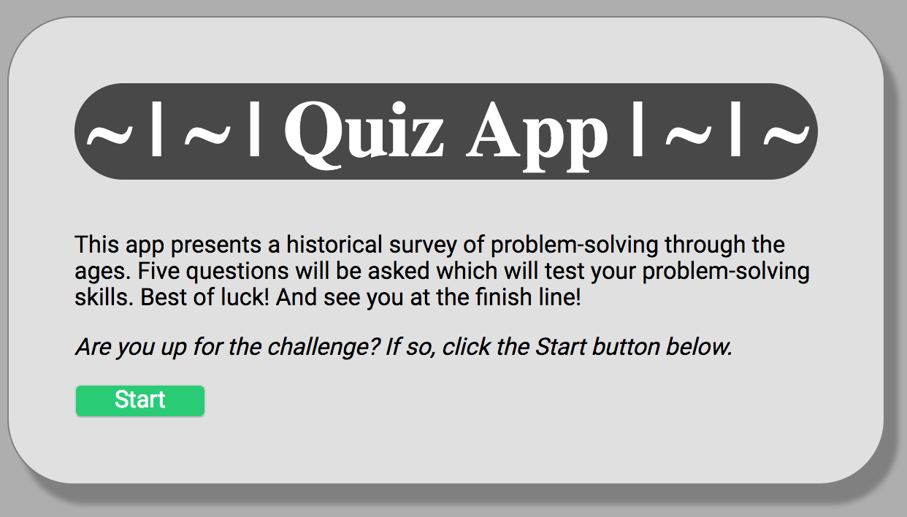
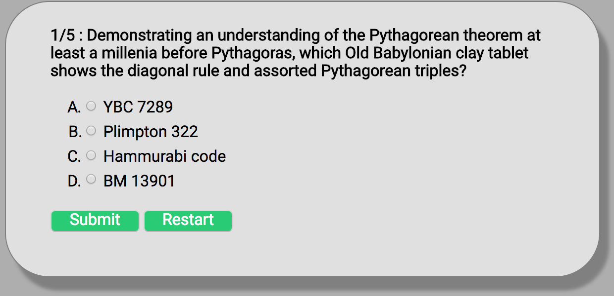

# Quiz App

## Introduction
Quiz app lets you take a quiz and return your score after submitting the final answer. You may also restart whenever you think you're not going to get your perfect score ;).

## Use Case
Why is this app useful? Well, it's not. It's just fun! It was something that was done to demonstrate web fundamentals at the time. 

## Live Site
You can access the app at https://prince-codes.github.io/quiz-app/

## Technical
The front-end is built using HTML5, and CSS3 and JavaScript with no back-end.

